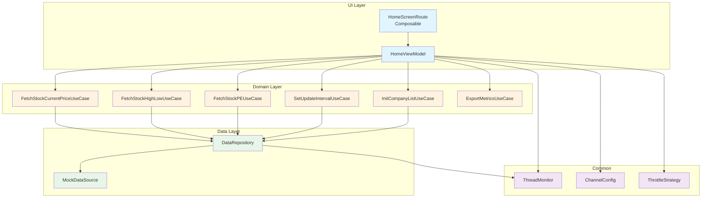
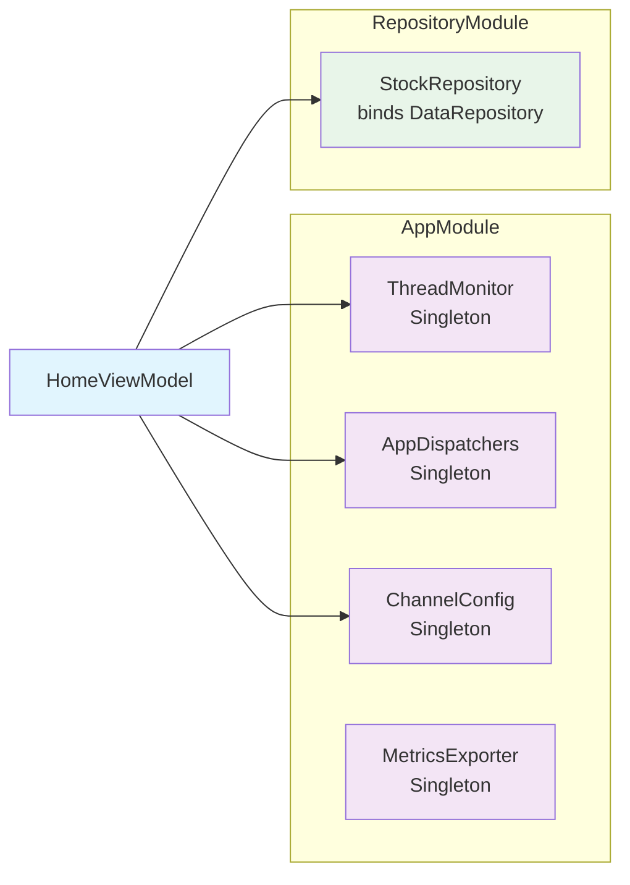
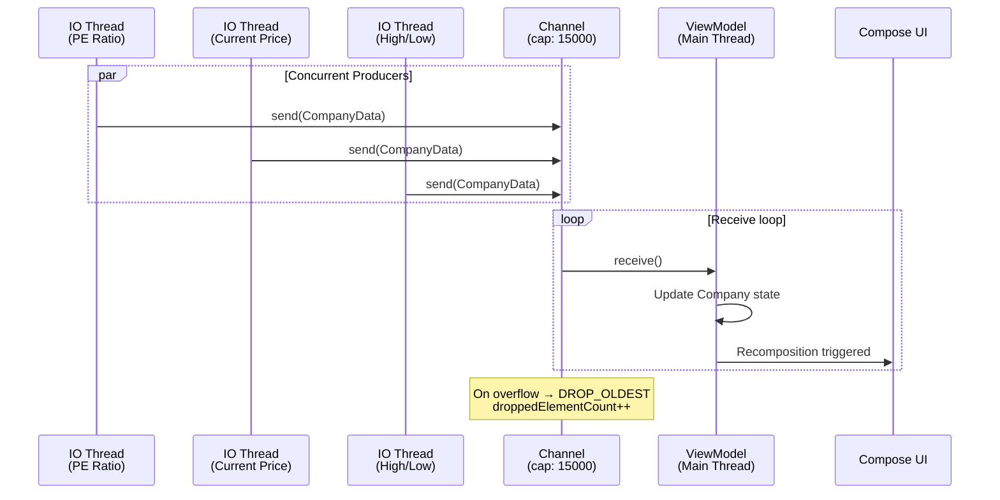

# ThreadSimulator

[](https://github.com/buddhasaikia/ThreadSimulator/actions/workflows/ci.yml)


**ThreadSimulator** is an Android application that simulates real-time, multi-threaded stock data updates rendered in a Jetpack Compose LazyList. It demonstrates how concurrent coroutine producers push data through a shared Kotlin Channel, and how throttling strategies control UI update frequency — a practical playground for exploring threading, back-pressure, and performance in modern Android apps.

---

## Table of Contents

- [Features](#features)
- [Architecture Overview](#architecture-overview)
- [Threading Model](#threading-model)
- [Project Structure](#project-structure)
- [Tech Stack](#tech-stack)
- [Getting Started](#getting-started)
- [Usage](#usage)
- [Configuration](#configuration)
- [Troubleshooting](#troubleshooting)
- [Performance Benchmarks](#performance-benchmarks)
- [Screenshots](#screenshots)
- [CI / Code Quality](#ci--code-quality)
- [Contributing](#contributing)
- [License](#license)
- [Contact](#contact)

---

## Features

- **Multi-threaded data simulation** — Concurrent coroutines on `Dispatchers.IO` fetch PE ratio, current price, and high/low prices independently for each company
- **Channel-based aggregation** — All producer coroutines write to a single buffered `Channel` (capacity 15,000, `DROP_OLDEST` overflow) for fan-in aggregation
- **Configurable throttling** — Three built-in strategies (RAPID ~60 FPS, NORMAL ~30 FPS, RELAXED ~15 FPS) control how often UI updates are emitted
- **Real-time thread metrics** — Live display of thread IDs, update counts, and average update times per thread
- **Dropped element tracking** — Monitors and displays the count of elements dropped due to channel overflow
- **Adjustable update intervals** — Change PE, price, and high/low update intervals at runtime
- **Dynamic list sizing** — Configure how many companies are simulated (5, 10, 50, 100+)
- **Metrics export** — Export thread metrics to CSV or JSON format
- **Jetpack Compose UI** — Modern declarative UI with Material 3
- **Clean Architecture** — Data → Domain → UI layers with Hilt dependency injection

---

## Architecture Overview

The project follows Clean Architecture principles with three distinct layers:



### Component Dependency Injection (Hilt)



---

## Threading Model

### Data Flow: Producers → Channel → UI

Multiple coroutines run concurrently on `Dispatchers.IO`, each producing a different type of stock data. All updates funnel through a single **Kotlin Channel** and are consumed on the main thread to update the Compose UI.



### Throttle Strategies

The `ThrottleStrategy` object provides three levels for controlling emission frequency. Throttling is applied via the `Flow.throttleUpdates()` extension — only emissions spaced at least `windowMs` apart are forwarded; errors always pass through immediately.

| Strategy | Interval | Frame Rate | Best For |
|----------|----------|-----------|----------|
| `RAPID` | 16 ms | ~60 FPS | Current price — fast-moving data needing responsive updates |
| `NORMAL` | 32 ms | ~30 FPS | High/low prices — balanced performance and responsiveness |
| `RELAXED` | 64 ms | ~15 FPS | PE ratio — infrequent changes, minimal CPU usage |

> **Auto-adjustment**: When the list size exceeds a threshold, the ViewModel automatically switches to a more relaxed throttling strategy to maintain smooth scrolling performance.

### Channel Configuration

| Parameter | Default | Description |
|-----------|---------|-------------|
| `capacity` | 15,000 | Maximum buffered elements before overflow strategy activates |
| `onBufferOverflow` | `DROP_OLDEST` | Drops the oldest element when buffer is full (non-blocking) |

The `ChannelConfig` is injectable via Hilt, making it easy to test different buffer sizes and overflow strategies.

### Thread Metrics Monitoring

The `ThreadMonitor` class records real-time performance data for each worker thread:

- **Thread ID & Name** — Identifies which coroutine/thread performed the update
- **Update Type** — What kind of data was updated (PE, CurrentPrice, HighLow)
- **Update Count** — Total number of updates from each thread
- **Average Update Time** — Mean duration per update operation (ms)

Metrics are stored in `ConcurrentHashMap` with `AtomicLong` counters for thread-safe access, and exposed as a `StateFlow<List<ThreadMetrics>>` for reactive UI updates.

---

## Project Structure

```
app/src/main/java/com/bs/threadsimulator/
├── App.kt                          # Application class (Hilt entry point)
├── MainActivity.kt                 # Single activity host
├── common/
│   ├── AppDispatchers.kt           # Dispatcher abstraction (interface + production impl)
│   ├── ChannelConfig.kt            # Channel capacity & overflow config
│   ├── FlowExt.kt                  # throttleUpdates() Flow extension
│   ├── MetricsExporter.kt          # CSV/JSON export for thread metrics
│   ├── ThreadMetrics.kt            # ThreadMetrics data class + ThreadMonitor
│   └── ThrottleStrategy.kt         # RAPID/NORMAL/RELAXED throttle constants
├── data/
│   ├── CompanyInfo.kt              # Data-layer company model
│   ├── DataRepository.kt           # StockRepository implementation
│   ├── MockDataSource.kt           # Simulated stock data generator
│   ├── StockInfo.kt                # Data-layer stock model
│   └── repository/
│       └── StockRepository.kt      # Repository interface
├── di/
│   └── AppModule.kt                # Hilt modules (AppModule + RepositoryModule)
├── domain/
│   ├── ExportMetricsUseCase.kt     # Export metrics use case
│   ├── FetchStockCurrentPriceUseCase.kt
│   ├── FetchStockHighLowUseCase.kt
│   ├── FetchStockPEUseCase.kt
│   ├── InitCompanyListUseCase.kt
│   ├── SetUpdateIntervalUseCase.kt
│   ├── UpdateIntervalType.kt       # Type-safe enum for interval types
│   └── model/
│       ├── CompanyData.kt          # Domain-layer company model
│       └── Stock.kt                # Domain-layer stock model
├── mapper/
│   ├── DataToDomainMapper.kt       # Data → Domain mapping
│   ├── DataToUIMapper.kt           # Data → UI mapping
│   └── DomainToUIMapper.kt         # Domain → UI mapping
├── model/
│   ├── Company.kt                  # UI-layer company (Compose state)
│   ├── ExportedMetrics.kt          # Exported metrics result model
│   ├── Resource.kt                 # Resource sealed class (Loading/Success/Error)
│   ├── StateError.kt               # Error state wrapper
│   └── Stock.kt                    # UI-layer stock (Compose state)
├── ui/
│   ├── screens/
│   │   ├── HomeScreenRoute.kt      # Main Compose screen
│   │   ├── HomeViewModel.kt        # ViewModel with threading logic
│   │   └── components/             # Reusable UI components
│   └── theme/                      # Material 3 theme
└── utils/
    └── InputValidator.kt           # Input validation utilities
```

---

## Tech Stack

| Category | Technology |
|----------|-----------|
| **Language** | Kotlin 2.1 |
| **UI** | Jetpack Compose + Material 3 |
| **Concurrency** | Kotlin Coroutines + Channels |
| **DI** | Hilt (Dagger) with KSP |
| **Architecture** | MVVM + Clean Architecture |
| **Logging** | Timber |
| **Testing** | JUnit, MockK, Turbine, Coroutines Test |
| **Code Quality** | ktlint, detekt, Android Lint |
| **CI** | GitHub Actions |
| **Min SDK** | 24 (Android 7.0) |
| **Target SDK** | 35 |

---

## Getting Started

### Prerequisites

- **Android Studio** Ladybug or later
- **JDK 17**
- **Android SDK** with API level 35 installed

### Installation

1. **Clone the repository**:
    ```sh
    git clone https://github.com/buddhasaikia/ThreadSimulator.git
    ```

2. **Open in Android Studio**:
    - File → Open → select the project directory

3. **Build the project**:
    ```sh
    ./gradlew assembleDebug
    ```

4. **Run on emulator or device**:
    - Run → Run 'app', or:
    ```sh
    ./gradlew installDebug
    ```

---

## Usage

1. **Launch the app** on your device or emulator
2. **Set the list size** — choose how many companies to simulate (e.g., 5, 10, 50)
3. **Press Start** — concurrent coroutines begin fetching stock data
4. **Observe the LazyList** — watch real-time updates to PE ratios, prices, and highs/lows
5. **Monitor thread metrics** — see which threads are performing updates, how many, and how fast
6. **Adjust intervals** — change update intervals for PE, current price, and high/low while running
7. **Export metrics** — tap CSV or JSON export to save thread performance data
8. **Press Stop** — cancel all active coroutines

---

## Configuration

### Update Intervals (runtime-adjustable)

| Parameter | Default | Description |
|-----------|---------|-------------|
| PE Ratio interval | 1500 ms | Delay between PE ratio updates per company |
| Current Price interval | 1000 ms | Delay between current price updates per company |
| High/Low interval | 1000 ms | Delay between high/low price updates per company |
| List size | 5 | Number of companies to simulate |

### Channel Tuning

Modify `ChannelConfig` defaults in `AppModule.kt` to experiment:

```kotlin
// Example: Larger buffer with SUSPEND strategy
@Provides @Singleton
fun provideChannelConfig(): ChannelConfig = ChannelConfig(
    capacity = 50_000,
    onBufferOverflow = BufferOverflow.SUSPEND
)
```

---

## Troubleshooting

### Common Issues

| Problem | Cause | Solution |
|---------|-------|----------|
| **UI freezes with large lists** | Too many updates overwhelming the main thread | Increase throttle interval or switch to `RELAXED` strategy; reduce list size |
| **High dropped element count** | Channel buffer full faster than consumer can process | Increase `ChannelConfig.capacity` or slow down producer intervals |
| **Metrics show 0 updates** | Simulation not started or coroutines canceled | Ensure you pressed **Start** and that the list is populated |
| **Export fails** | File permissions or storage access | Check app storage permissions; review Logcat for errors |
| **Build fails with KSP errors** | Hilt annotation processing issue | Run `./gradlew clean` then rebuild; ensure KSP version matches Kotlin version |
| **Tests fail with dispatcher issues** | Using real dispatchers in tests | Use `TestAppDispatchers` to inject `UnconfinedTestDispatcher` |

### Debugging Tips

- **Enable Timber logging**: Debug logs show channel send/receive activity and undelivered elements
- **Watch `droppedElementCount`**: A rising count means your channel buffer is saturating — increase capacity or reduce producer speed
- **Thread metrics**: If `avgUpdateTimeMs` is high for a thread, investigate whether the mock data source introduces excessive delay
- **StrictMode**: Enable StrictMode in debug builds to catch accidental main-thread I/O

---

## Performance Benchmarks

Expected behavior under different configurations (simulated data, results vary by device):

| List Size | Throttle | Producers | Channel Fills | Dropped Elements | UI Smoothness |
|-----------|----------|-----------|---------------|------------------|---------------|
| 5 | RAPID (16 ms) | 15 | No | ~0 | ★★★★★ Smooth |
| 10 | RAPID (16 ms) | 30 | Rare | Low | ★★★★☆ Good |
| 50 | NORMAL (32 ms) | 150 | Occasional | Moderate | ★★★★☆ Good |
| 100 | RELAXED (64 ms) | 300 | Frequent | High | ★★★☆☆ Acceptable |
| 100 | RAPID (16 ms) | 300 | Yes | Very High | ★★☆☆☆ Janky |

> **Key insight**: With 100 companies and 3 producers each (= 300 concurrent coroutines), the `RELAXED` throttle strategy is essential to maintain usable frame rates. The auto-adjustment feature handles this automatically.

---

## Screenshots

<!-- TODO: Add actual screenshots or GIFs of the app in action -->
<!-- Suggested captures:
  1. Main screen with stock list updating in real-time
  2. Thread metrics panel showing active threads
  3. Configuration panel with interval inputs
  4. Metrics export (CSV/JSON) result
-->

*Screenshots and GIFs coming soon — contributions welcome!*

---

## CI / Code Quality

The project uses **GitHub Actions** for continuous integration with four parallel checks:

| Job | Command | Description |
|-----|---------|-------------|
| **ktlint** | `./gradlew ktlintCheck` | Kotlin code style enforcement |
| **detekt** | `./gradlew detekt` | Static analysis for code smells |
| **lint** | `./gradlew lint` | Android Lint checks |
| **unit tests** | `./gradlew test` | JUnit + MockK + Turbine tests |

All checks run on every push to `main`/`master` and on pull requests.

---

## Contributing

Contributions are what make the open source community such an amazing place to learn, inspire, and create. Any contributions you make are **greatly appreciated**.

1. Fork the Project
2. Create your Feature Branch (`git checkout -b feature/AmazingFeature`)
3. Commit your Changes (`git commit -m 'Add some AmazingFeature'`)
4. Push to the Branch (`git push origin feature/AmazingFeature`)
5. Open a Pull Request

---

## License

Distributed under the MIT License. See `LICENSE` for more information.

---

## Contact

Buddha Saikia — [@bsaikia2860](https://x.com/BSaikia2860) — bsaikia.dev@gmail.com

Project Link: [https://github.com/buddhasaikia/ThreadSimulator](https://github.com/buddhasaikia/ThreadSimulator)